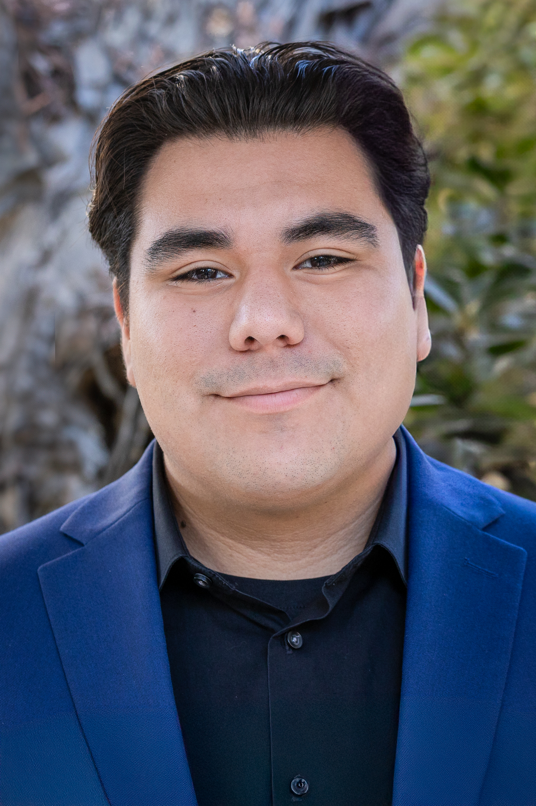

# **Aaron Delgado**



## About Me
Hello I am a second year Marshall student majoring in Computer engineering. In my free time I like to either try out new coffee shops or crochet. 


## List of Contents
- [**Aaron Delgado**](#aaron-delgado)
  - [About Me](#about-me)
  - [List of Contents](#list-of-contents)
  - [Hobbies](#hobbies)
  - [Life Goals](#life-goals)
  - [Tasks of the Week](#tasks-of-the-week)
  - [Quotes](#quotes)
  - [Begining code](#begining-code)
  - [My Github](#my-github)
  - [Read Me File](#read-me-file)


## Hobbies
- Crocheting
- Motorcycle Riding
- Baking

## Life Goals
1. Travel
2. Buy my own house
3. Build a great community of friends

## Tasks of the Week
- [x] Finish Lab 1
- [ ] Finish Lab 2
- [ ] Finish ECE 45 Homework

## Quotes
“*The art of debugging is figuring out what you really told your program to do rather than what you thought you told it to do.*” - Andrew Singer

## Begining code

```cpp
#include <iostream>
using namespace std;

int main(){
    cout << "Hello World" << endl;
    return 0;
}
```

## [My Github](https://github.com/aarond67)


## Read Me File
[Read Me](README.md)

